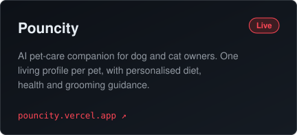
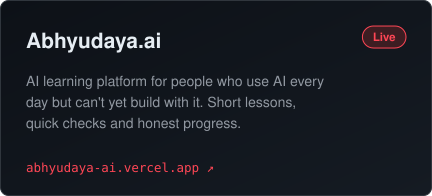
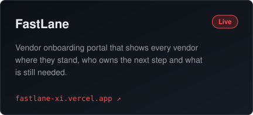
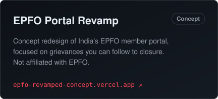

  
  
  
  
  
  
  
  

I spent four years in product analytics at Physics Wallah and now Kavana, and
somewhere along the way I stopped being satisfied with telling teams what the
data said. So I started building the products myself.

Most of the job is not glamorous. Agreeing on the one metric that matters before
anything gets built. Testing an AI feature properly before a user ever sees it. The interesting
part of product work is usually the decision nobody sees.

### Products

  
  

  
  

Code for each lives in [pouncity](https://github.com/VipulKhandelwal04/pouncity),
[Abhyudaya-AI](https://github.com/VipulKhandelwal04/Abhyudaya-AI),
[Fastlane](https://github.com/VipulKhandelwal04/Fastlane) and
[EPFO-Portal-Revamp](https://github.com/VipulKhandelwal04/EPFO-Portal-Revamp-Case-Study-Purpose-Only).
On the side: [productivity-break](https://github.com/VipulKhandelwal04/productivity-break),
a macOS nudge that puts up a full-screen break reminder every 25 minutes of terminal focus.

### How I work

Day to day:

- **SQL and BigQuery** for funnels, experiments and root cause analysis
- **Mixpanel and Langfuse** to see what users do and what the AI costs
- **Airflow** for the data pipelines that keep the numbers honest
- **Claude Code** with MCPs and skills to go from PRD to a live product

Comfortable enough with:

- Python and JavaScript, enough to prototype and read what engineering ships
- Next.js, Supabase and Vercel for getting a product in front of real users
- Power BI, Tableau and Looker Studio when a team needs a dashboard, not a debate

Opinions I hold quietly:

- Decide what you will measure before you decide what you will build
- An AI feature is not ready because the demo worked. It is ready when it passes the evals
- Start rule-based. Earn the complex model with usage data
- If a feature is not used, it is not a feature. It is maintenance

### Get in touch

  
  
  

Open to AI PM, PM and founding AI PM roles in Bengaluru, Delhi NCR or remote.
